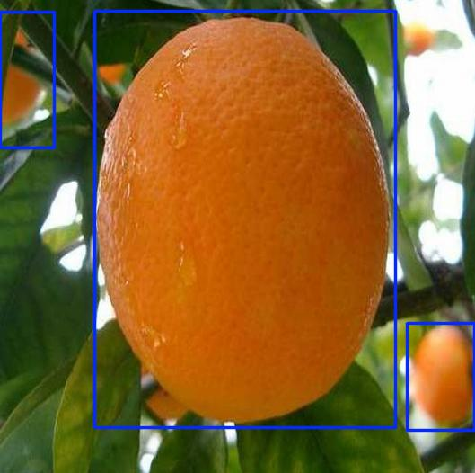
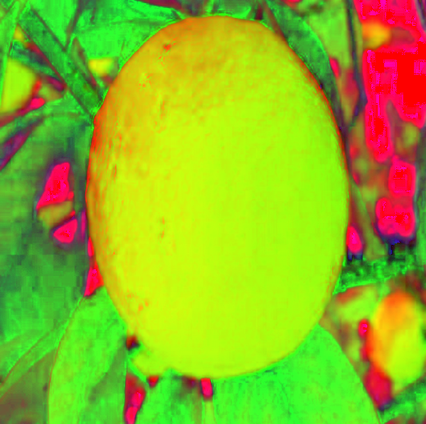
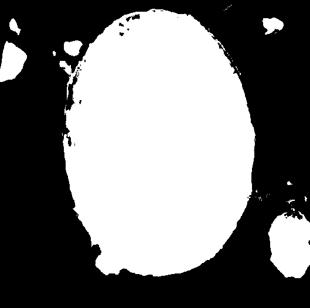
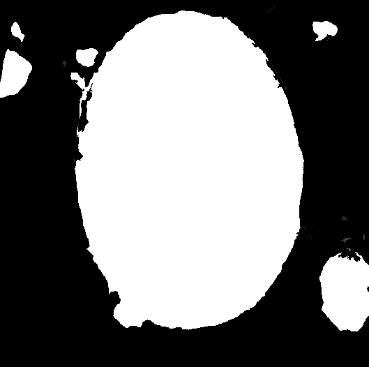
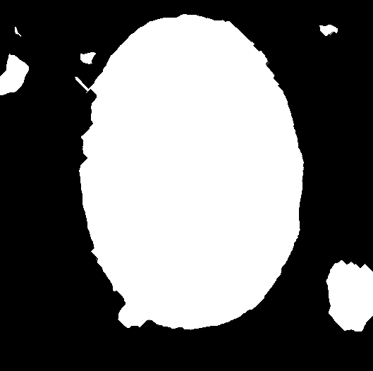
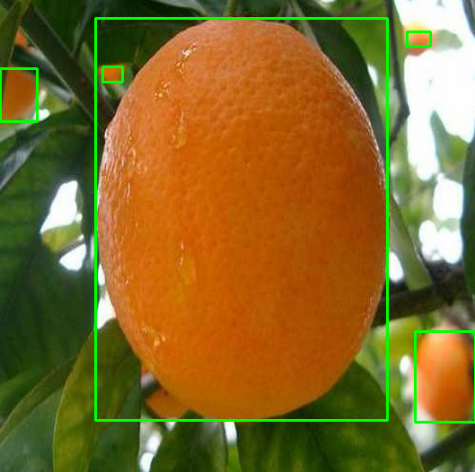

# Contagem  de laranjas 

Esse projeto tem como objetivo fazer a contagem de laranjas e pé de erva mate através de usos de diferentes tecnicas e modelos de inteligência artificial.

## Dataset
O dataset usado para laranjas é uma junção das imagens disponíveis no [kaggle](https://www.kaggle.com/datasets/balraj98/apple2orange-dataset) e [images.cv](https://images.cv/download/orange/1366) assim foi utilizada a plataforma roboflow para fazer as anotações dos rotulos das imagens.

## Técnicas usadas

### Yolo

[YOLO](https://docs.ultralytics.com/#yolo-a-brief-history) (You Only Look Once) é um modelo popular de detecção de objetos e segmentação de imagem. Existem várias versões deste modelo onde abaixo estão listadas as versões usadas.
Com o yolo é necessário fazer o treinamento com base nos modelos abaixo para que ele seja capaz de fazer a classificação.

**Modelos Yolo usados**

- [Yolo v5](https://docs.ultralytics.com/models/yolov5/)
- [Yolo v8](https://docs.ultralytics.com/models/yolov8/)
- [Yolo v9](https://docs.ultralytics.com/models/yolov9/)
- [Yolo v11](https://docs.ultralytics.com/models/yolo11/)



### Visão computacional
Foram utilizados duas bibliotecas para visão computacional, opencv e scikit-image, ambas foram utilizadas com a técnica de contagem de objetos da cor branca conectados.

#### Pre processamento
1. Converter a imagem para o sistema de cores HSV.


2. Criar uma máscara onde será branco as cores na faixa de cores laranja será branco e as outras cores preto. Foi definido o limite inferior para [10, 100, 20] e superior [25, 255, 255].


3. Preencher os espaços vazios dentro dos objetos com a cor branca.


4. Aplicar o processo de dilatação e erosão algumas vezes na imagem para eliminar ruidos pequenos.


#### Detecção 
1. Com Cv2 foi utilizada a função connectedComponentsWithStats com a imagem pre processada onde é retornada as caixas delimitadoras que serão adicionadas na imagem original.


2. Com scikit-image foram utilizadas as funções label, onde rotula as regiões conectadas na imagem, e regionprops, onde mede as propriedades da imagem rotulada.


## Instalação
Python necessário para execução do codigo é 3.10.13. E para instalar as  bibliotecas necessárias execute o código abaixo: 
```
pip install -r requirements.txt
```

## Execução

### YOLO 
Para executar o algoritmo que detecta laranjas com yolo edite o arquivo `deteccao_yolo.py` na linha 47 para modelo treinado e a imagem desejada. Em seguida execute o código:
```
python deteccao_yolo.py
```

### Visão computacional
Para executar o algoritmo que detecta laranjas com opencv2 e scikit-image edite o arquivo `deteccao_cv2.py` na linha 5 com imagem desejada. Em seguida execute o código:
```
python deteccao_cv2.py
```

## Testes
Foram selecionadas imagems que não estão no conjunto de dados e feita a contagem manual das laranjas presentas na imagem, assim foi utilizado todas as diferentes ténicas nelas para assim criar uma tabela comparativa. Abaixo é apresentada a tabela comparativa entre a acurácia das diferentes ténicas
| Técnica | OpenCV | skimage | YOLO v5 | YOLO v8 | YOLO v9 | YOLO v11 | 
| :--: | :--: | :--: | :--: | :--: | :--: | :--: |
| Acurácia | 10,37% | 10,99% | 52,23% | 57,28% | 58,08% |54,25% |

Todas a imagens rotuladas manualmente estão no diretório `teste/imagens_teste_rotuladas/`

### Código
Foi executado o código no presente no arquivo `teste.py` nele são selecionadas as imagens no diretório `teste/imagens_originais/` e aplicado os algoritmos de contagem criando as imagens rotuladas salvas nas respectivas pastas de cada ténicas dentro do diretporio `teste/resultados/` e contendo um arquivo json contendo a contagem de laranjas na imagem.


